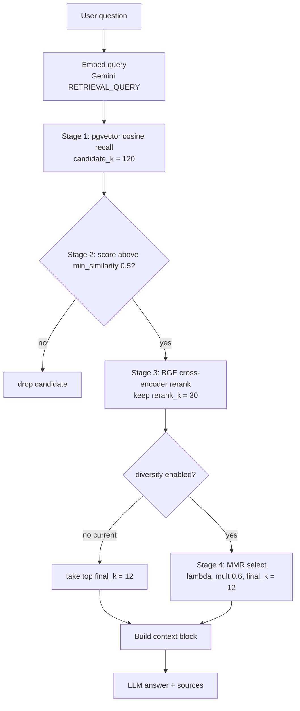
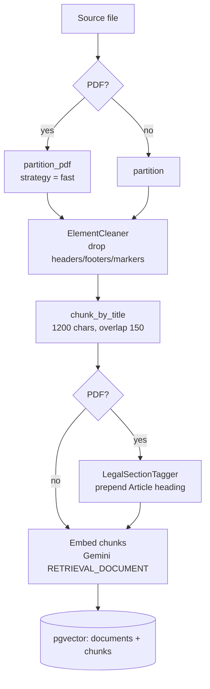

# RAG System Architecture

This document explains how the current RAG system works in this project, with focus on startup, ingestion, embeddings, pgvector storage, metadata, and retrieval.

## High-Level Architecture

The system is a FastAPI RAG application.

The main flow is:

```text
Source documents
-> document loaders (partition -> clean -> chunk_by_title -> legal tag)
-> text chunks + metadata
-> embedding model (Gemini, asymmetric task types)
-> pgvector tables
-> user question
-> query embedding
-> STAGE 1: cosine-similarity vector recall (candidate_k)
-> STAGE 2: min_similarity floor
-> STAGE 3: BGE cross-encoder rerank (rerank_k)
-> STAGE 4: MMR diversity (final_k)   [disabled -> top final_k]
-> LLM prompt
-> final answer + sources
```

### Retrieval pipeline flow chart



### Ingestion flow chart



Main runtime components:

```text
src/api.py
  FastAPI app and /ask endpoint

src/startup.py
  Startup initialization for the selected vector store backend

src/ai/service_factory.py
  Creates the selected LLM, embedder, vector store, and RAG facade

src/ai/rag_service.py
  Coordinates the multi-stage retrieval pipeline and answer generation

src/ai/document_loaders/
  Reads documents, cleans layout noise, chunks, and tags legal sections

src/ai/rerankers/
  Cross-encoder rerankers (BGE active, FlashRank available) behind a registry

src/ai/diversity/
  MMR diversity selector (implemented; disabled via config)

src/ai/vector_store_service/pgvector/
  Stores and searches chunks using PostgreSQL + pgvector

src/common/timing.py
  timed_step context manager; logs per-stage start/end/duration

src/ingestion/
  Explicit command used to ingest source documents into pgvector
```

The configured vector backend is pgvector:

```yaml
vector_store:
  backend: "pgvector"
  collection: "default"
  pgvector:
    metric: "cosine"
```

## Startup Process

Startup begins in `src/api.py` through FastAPI lifespan:

```python
@asynccontextmanager
async def lifespan(app: FastAPI):
    initialize_vector_store()
    rag_facade = initialize_rag_facade()
    yield
```

The startup flow is:

```text
main.py
-> imports src.api:app
-> FastAPI lifespan starts
-> initialize_vector_store()
-> ServiceFactory.get_vector_store_initializer().initialize()
-> initialize_rag_facade()
-> /ask endpoint becomes usable
```

Important detail: startup does not ingest documents. It only verifies that the configured vector store is reachable and compatible.

For pgvector, startup calls:

```text
src/ai/vector_store_service/pgvector/pgvector_store_initializer.py
```

That initializer does this:

```text
1. Opens a database session using DATABASE_URL.
2. Runs SELECT 1 to confirm the database is reachable.
3. Looks for the configured collection name, currently "default".
4. If the collection exists, validates provider, model, and dimensions.
5. Counts chunks in the collection.
6. Logs readiness or a warning if the collection is missing or empty.
```

If the tables do not exist, startup fails with errors like:

```text
relation "embedding_collections" does not exist
```

That means Alembic migrations were not applied.

Required database setup command:

```bash
/opt/miniconda3/envs/ai_rag/bin/python -m alembic upgrade head
```

Required ingestion command after migrations:

```bash
/opt/miniconda3/envs/ai_rag/bin/python -m src.ingestion --collection default
```

## Configuration

The current embedding and retrieval configuration is in `config.yaml`.

Current LLM provider:

```yaml
llm:
  provider: "gemini"
```

Current Gemini chat model:

```yaml
gemini:
  model: gemini-2.5-pro
```

Current Gemini embedding model:

```yaml
gemini:
  embedding_model: models/gemini-embedding-001
```

Current embedding dimension:

```yaml
llm:
  gemini:
    embeddings_dimension: 3072
```

Current retrieval pipeline configuration:

```yaml
retrieval:
  candidate_k: 120   # stage 1: wide vector-recall pool
  rerank_k: 30       # stage 3: kept after cross-encoder reranking
  final_k: 12        # stage 4: chunks fed into the LLM
  min_similarity: 0.5  # stage 2: cosine floor on the pool

reranking:
  enabled: true
  provider: "bge"                    # or "flashrank"
  flashrank:
    model: "ms-marco-MiniLM-L-12-v2"
  bge:
    model: "BAAI/bge-reranker-v2-m3"

# diversity block is commented out -> MMR disabled -> pipeline returns top final_k
# diversity:
#   strategy: "mmr"
#   lambda_mult: 0.6
```

`llm.default_k: 20` still exists but is **legacy**: it no longer drives `/ask` and is used
only by the raw vector-search regression tests.

Current chunking configuration:

```yaml
document_loader:
  chunk_size: 1200
  chunk_overlap: 150
  pdf_strategy: "fast"   # unstructured partition_pdf strategy (fast | hi_res)
  docs_directory: "docs"
  ocr_docs_dir: "ocr_docs"
  llm_extractor_docs_dir: "llm_extractor_docs"
  scanned_docs_lang: "ara"
```

See `architect-choices.md` for why these values were chosen (reranker, `min_similarity`
threshold, MMR disabled, `fast` vs `hi_res`, chunk sizing).

## Embedding Model

The active embedder is selected by `ServiceFactory` from `llm.provider`.

Current provider:

```text
gemini
```

Current embedder implementation:

```text
src/ai/embedders/gemini/gemini_embedder.py
```

It uses LangChain's Gemini embedding wrapper:

```python
GoogleGenerativeAIEmbeddings(
    model="models/gemini-embedding-001",
    api_key=os.getenv("GOOGLE_API_KEY"),
)
```

**Asymmetric task types.** Documents and queries are embedded with different Gemini
`task_type` values, which map them into aligned but role-specific subspaces and materially
improve retrieval quality:

```text
embed_documents -> task_type = RETRIEVAL_DOCUMENT
embed_query     -> task_type = RETRIEVAL_QUERY
```

Requests are batched (100 texts/request) and retried with exponential backoff (`tenacity`)
on transient Gemini errors.

For this project, the model returns vectors with dimension:

```text
3072
```

That dimension is important because each pgvector collection is bound to one embedding configuration:

```text
provider + model + dimensions
```

For the current default collection:

```text
provider: gemini
model: models/gemini-embedding-001
dimensions: 3072
```

If the application tries to query the same collection with a different provider, model, or dimension, `CollectionValidator` rejects it. This prevents corrupt retrieval results caused by mixing incompatible vector spaces.

Azure is also supported in code, but not active right now. Azure uses:

```yaml
azure:
  embedding_deployment: text-embedding-3-small

llm:
  azure:
    embeddings_dimension: 1536
```

## pgvector Collection Meaning

In this project, `vector_store.collection` is a logical bucket of chunks embedded with the same embedding model.

Current config:

```yaml
vector_store:
  collection: "default"
```

The collection name maps to a row in the `embedding_collections` table.

Use collections to separate:

```text
different datasets
different tenants
different environments
different embedding-model versions
```

Examples:

```yaml
collection: "legal_docs"
collection: "hr_docs"
collection: "default_v2"
```

Do not reuse the same collection with a different embedding model or dimension.

## Database Tables

The pgvector schema is created by Alembic migration:

```text
alembic/versions/0001_init_pgvector.py
```

The migration creates the pgvector extension:

```sql
CREATE EXTENSION IF NOT EXISTS vector
```

### `embedding_collections`

Purpose: one row per logical vector collection.

Important columns:

```text
id
name
provider
model
dimensions
created_at
updated_at
```

Example:

```text
name: default
provider: gemini
model: models/gemini-embedding-001
dimensions: 3072
```

This table protects the system from querying a collection with the wrong embedding model.

### `documents`

Purpose: one row per source document inside a collection.

Important columns:

```text
id
collection_id
source
checksum
metadata
created_at
updated_at
```

`source` is the original file path, for example:

```text
docs/my-rag-system.md
docs/regulation eu 20241689 of the european parliament-FXL2401689EN.pdf
```

`checksum` is a SHA-256 checksum of the ordered chunk contents. It is used to skip re-embedding unchanged documents.

`metadata` is document-level JSONB metadata. It is derived from chunk metadata by removing chunk-specific fields like `source` and `page`.

### `chunks`

Purpose: one row per chunk. This is the main retrieval table.

Important columns:

```text
id
document_id
collection_id
chunk_index
page
language
loader
content
checksum
metadata
embedding
embedding_dimensions
created_at
updated_at
```

The important RAG fields are:

```text
content              actual text sent to the LLM
embedding            vector used for similarity search
page                 page number if available
language             detected or configured language if available
loader               text, ocr, or llm_extractor
metadata             extra JSONB metadata not promoted to columns
embedding_dimensions dimension safety check
```

The migration adds a database constraint:

```sql
vector_dims(embedding) = embedding_dimensions
```

That prevents saving a vector whose actual dimension does not match the expected collection dimension.

### `alembic_version`

Purpose: tracks which Alembic migrations have been applied.

This is not a RAG table. It is migration bookkeeping.

## Document Readers And Metadata

The system has three document loaders.

All loaders currently return two aligned lists:

```python
texts: list[str]
metadatas: list[dict]
```

The index in each list connects a chunk to its metadata:

```text
texts[0] belongs to metadatas[0]
texts[1] belongs to metadatas[1]
```

This works, but it is fragile. A planned improvement is to replace this with a single `DocumentChunk` Pydantic model containing both content and metadata.

### TextDocumentLoader

File:

```text
src/ai/document_loaders/text_document_loader.py
```

Input directory:

```yaml
docs_directory: "docs"
```

Libraries (Unstructured, not LangChain splitters):

```text
unstructured.partition.pdf.partition_pdf   (PDFs)
unstructured.partition.auto.partition      (other file types)
unstructured.chunking.title.chunk_by_title
ElementCleaner        (local: element_cleaner.py)
LegalSectionTagger    (local: legal_section_tagger.py)
```

Pipeline (`load_documents`):

```text
1. Partition file into typed elements.
   - PDFs: partition_pdf(strategy=pdf_strategy)  # "fast" text-layer parse
   - Others: partition(...)
2. ElementCleaner.clean(elements)
   - drops Header/Footer/PageNumber/PageBreak/Image categories
   - drops standalone number markers like "(9)", ELI footers, running-header leaks
   - drops fragments shorter than 15 chars
3. chunk_by_title(
       max_characters=1200,
       new_after_n_chars=960,          # 0.8 * chunk_size
       combine_text_under_n_chars=420, # 0.35 * chunk_size
       overlap=150,
       multipage_sections=True,
   )
4. For PDFs only: LegalSectionTagger.tag(texts)
   - prepends the governing "Article N ..." heading to continuation chunks
```

**Why this replaced fixed-size splitting.** The old `RecursiveCharacterTextSplitter`
(500/60) cut mid-clause. `chunk_by_title` breaks on document structure (titles/sections),
and the cleaner + tagger remove layout noise and re-anchor orphaned legal clauses. Rationale
in `architect-choices.md` §5–§7.

Metadata behavior — an allowlist is kept, everything else is dropped:

```text
_KEEP_METADATA_KEYS = ("source", "filename", "page", "language")
source    = the file path
filename  = Unstructured filename
page      = element page_number
language  = first detected language
```

Saved metadata examples:

```python
{
    "source": "docs/my-rag-system.md",
    "filename": "my-rag-system.md",
    "page": 1,
    "language": "eng",
}
```

### OcrDocumentLoader

File:

```text
src/ai/document_loaders/ocr_document_loader.py
```

Input directory:

```yaml
ocr_docs_dir: "ocr_docs"
```

Libraries:

```text
pdf2image.convert_from_path
pytesseract
RecursiveCharacterTextSplitter
```

Algorithm:

```text
1. Iterate PDF files in ocr_docs.
2. Convert each PDF page to an image using pdf2image.
3. Run pytesseract.image_to_string on each image.
4. Split extracted page text into chunks.
5. Emit chunk text and metadata.
```

Metadata emitted by this loader:

```python
{
    "source": pdf_path,
    "page": i + 1,
    "lang": "ara",
    "ocr": True,
}
```

During pgvector mapping:

```text
lang -> language column
ocr: True -> loader column becomes "ocr"
source -> documents.source
page -> chunks.page
```

### LlmExtractorDocumentLoader

File:

```text
src/ai/document_loaders/llm_extractor_document_loader.py
```

Input directory:

```yaml
llm_extractor_docs_dir: "llm_extractor_docs"
```

Libraries:

```text
pdf2image.convert_from_path
Gemini/Azure LLM through BaseLLM
RecursiveCharacterTextSplitter
```

Algorithm:

```text
1. Iterate PDF files in llm_extractor_docs.
2. Convert each PDF page to an image.
3. Convert image to base64.
4. Send the image to the LLM with an extraction prompt.
5. Receive extracted text.
6. Split extracted text into chunks.
7. Emit chunk text and metadata.
8. Save raw extracted text to llm_extracted_text_temp for inspection.
```

Metadata emitted by this loader:

```python
{
    "source": pdf_path,
    "page": page_num,
    "lang": "ara",
    "llm_extracted": True,
}
```

During pgvector mapping:

```text
lang -> language column
llm_extracted: True -> loader column becomes "llm_extractor"
source -> documents.source
page -> chunks.page
```

## Ingestion Process

Ingestion is explicit. It is not automatically performed during app startup.

Command:

```bash
/opt/miniconda3/envs/ai_rag/bin/python -m src.ingestion --collection default
```

Entry point:

```text
src/ingestion/__main__.py
```

Main service:

```text
src/ingestion/ingestion_service.py
```

Ingestion algorithm:

```text
1. Create the configured embedder.
2. Create DocumentLoaderFacade.
3. Load all chunks and metadata from all configured loaders.
4. Group chunks by source path.
5. Get or create the target collection.
6. Validate provider/model/dimension for the collection.
7. List existing document sources in the collection.
8. For each source:
   - compute a checksum over the ordered chunk contents
   - if unchanged and not rebuild, skip it
   - otherwise upsert the document row
   - delete old chunks for that document
   - embed the new chunks
   - insert chunk rows with embeddings and metadata
9. Prune documents that exist in the DB but no longer exist in the source loader output.
```

The grouping algorithm is implemented in:

```text
src/ai/vector_store_service/pgvector/source_grouping.py
```

It groups by:

```python
metadata.get("source", "unknown")
```

The change detection algorithm is implemented in:

```text
src/ai/vector_store_service/pgvector/document_change_detector.py
```

It uses SHA-256:

```python
hashlib.sha256(content.encode("utf-8")).hexdigest()
```

For a full document, it hashes all chunk contents in order with a separator. This makes ingestion idempotent:

```text
same chunks -> same checksum -> skip re-embedding
changed chunks -> different checksum -> replace document chunks
```

Embedding and chunk row construction is shared in:

```text
src/ai/vector_store_service/pgvector/collection_writer.py
```

It calls:

```python
embeddings = self._embedder.embed_documents(texts)
```

Then creates one `Chunk` row per chunk:

```text
chunk_index
content
checksum
embedding
embedding_dimensions
page
language
loader
extra_metadata
```

## Metadata Mapping Into pgvector

The mapper is:

```text
src/ai/vector_store_service/pgvector/chunk_metadata_mapper.py
```

It separates metadata into promoted columns and JSONB remainder.

Input metadata example:

```python
{
    "source": "docs/example.pdf",
    "page": 3,
    "language": "eng",
    "loader": "text",
    "custom_key": "custom_value",
}
```

Stored as:

```text
documents.source = "docs/example.pdf"
chunks.page = 3
chunks.language = "eng"
chunks.loader = "text"
chunks.metadata = {"custom_key": "custom_value"}
```

For OCR metadata:

```python
{
    "source": "ocr_docs/file.pdf",
    "page": 1,
    "lang": "ara",
    "ocr": True,
}
```

Stored as:

```text
documents.source = "ocr_docs/file.pdf"
chunks.page = 1
chunks.language = "ara"
chunks.loader = "ocr"
chunks.metadata = {}
```

For LLM extractor metadata:

```python
{
    "source": "llm_extractor_docs/file.pdf",
    "page": 1,
    "lang": "ara",
    "llm_extracted": True,
}
```

Stored as:

```text
documents.source = "llm_extractor_docs/file.pdf"
chunks.page = 1
chunks.language = "ara"
chunks.loader = "llm_extractor"
chunks.metadata = {}
```

On retrieval, the mapper reconstructs metadata:

```text
source is re-injected from documents.source
page is added from chunks.page
language is added from chunks.language
loader is added from chunks.loader
extra JSONB metadata is merged back
```

The returned shape is:

```python
{
    "content": chunk.content,
    "metadata": {
        "source": "...",
        "page": 1,
        "language": "...",
        "loader": "...",
    },
}
```

## Retrieval Process

User questions are handled by:

```text
POST /ask
src/api.py
```

The endpoint calls:

```text
RagFacade.answer_question
-> RagService.answer_question
-> RagService._retrieve        # the multi-stage pipeline
-> VectorStoreFacade.search
-> PgVectorStore.search
-> ChunkRepository.search
```

The retrieval flow is (`RagService._retrieve`):

```text
1.  User sends a question.
2.  RagService reads candidate_k / rerank_k / final_k / min_similarity from config.yaml.
3.  PgVectorStore loads the configured collection; CollectionValidator checks
    provider/model/dimension.
4.  The question is embedded (RETRIEVAL_QUERY task type); dimension is checked.
5.  STAGE 1 - pgvector returns the candidate_k (120) nearest chunks by cosine distance,
    each with score = 1 - cosine_distance. Embeddings are fetched only if MMR is enabled.
6.  STAGE 2 - candidates with score < min_similarity (0.5) are dropped.
7.  STAGE 3 - if reranking.enabled, the BGE cross-encoder rescores the pool and keeps
    the top rerank_k (30).
8.  STAGE 4 - if the diversity block is present, MMR selects final_k (12); otherwise the
    top final_k are taken directly. (Currently MMR is disabled.)
9.  RagService formats the final chunks into a context block.
10. The context and question are sent to the LLM.
11. The API returns the answer and deduplicated sources.
```

Each stage is wrapped in `timed_step` (`src/common/timing.py`) and logs
`[TIMING] <stage> | start=... end=... duration=...s`. The BGE reranker additionally logs
`bge_model_load` (once per process, lazy) and `bge_inference` (per request).

## pgvector Search Algorithm

The actual search is implemented in:

```text
src/ai/vector_store_service/pgvector/repositories/chunk_repository.py
```

Code:

```python
distance = Chunk.embedding.cosine_distance(query_embedding).label("distance")
stmt = (
    select(Chunk, distance)
    .options(joinedload(Chunk.document))
    .where(Chunk.collection_id == collection_id)
    .order_by(distance)
    .limit(k)
)
```

This means:

```text
filter to one collection
compute cosine distance between each stored chunk embedding and the query embedding
sort by smallest cosine distance
return the first k rows, each with its distance
```

`PgVectorStore._to_result` converts distance to a similarity score before returning:

```python
"score": 1.0 - distance   # cosine_distance == 1 - cosine_similarity
```

This `score` is what the pipeline's `min_similarity` floor (stage 2) compares against, and
what MMR uses as the relevance signal. `k` here is `candidate_k` (120), not `final_k`.

The algorithm is nearest-neighbor search using cosine distance.

Cosine distance means:

```text
distance = 1 - cosine_similarity
```

Cosine similarity measures whether two vectors point in a similar direction. In RAG, vectors pointing in a similar direction should represent semantically similar text.

Lower cosine distance is better:

```text
0.0 = very similar
larger value = less similar
```

The current migration does not create an HNSW or IVFFlat approximate-nearest-neighbor index. So the current implementation is an exact ordered pgvector search for the current dataset size. For larger datasets, a production improvement would be adding an ANN index, for example HNSW, and tuning it.

## Reranking (Stage 3)

After the vector recall + similarity floor, a **local cross-encoder** rescores the pool.
Config: `reranking:` block; wiring: `ServiceFactory.get_reranker()` +
`ServiceFactory.RERANKER_PROVIDERS` registry.

```text
active provider: bge  (BAAI/bge-reranker-v2-m3)
available:       flashrank (ms-marco-MiniLM-L-12-v2)
enabled flag:    reranking.enabled = true
```

A cross-encoder feeds `(query, chunk)` **together** through one transformer forward pass
(full cross-attention) and emits a single relevance score — far more accurate than the
independent bi-encoder embeddings used in stage 1, and far more expensive, which is why it
runs only on the `candidate_k` pool. Implementation: `src/ai/rerankers/bge/bge_reranker.py`
loads the model lazily on first `rerank()` (then caches it), and returns the top `rerank_k`.

FlashRank was tried first and **degraded** ranking on legal text (MRR 0.672 → 0.513);
BGE replaced it. Full rationale and a FlashRank-vs-BGE comparison table are in
`architect-choices.md` §3.

## Diversity / MMR (Stage 4)

Maximal Marginal Relevance is implemented in `src/ai/diversity/mmr_selector.py` but the
`diversity:` config block is **commented out**, so `_retrieve` currently returns the top
`final_k` reranked chunks directly.

When enabled, MMR greedily picks chunks maximizing:

```text
score = lambda_mult * relevance(doc) - (1 - lambda_mult) * max_cosine_sim(doc, selected)
```

- `relevance` comes from the reranker's ordering (linear rank → [0,1]).
- redundancy = cosine similarity to already-selected chunks, over their stored embeddings.
- `lambda_mult = 0.6` leans toward relevance (1.0 = pure relevance, 0.0 = pure diversity).
- MMR is the **only** consumer of chunk embeddings, so `_retrieve` fetches embeddings from
  pgvector (`with_embeddings=True`) only when MMR is active.

It was disabled because, after the ingestion-cleanup fixes, the reranked top-12 were already
on-topic and diverse; MMR added embedding-fetch cost with no gold-set recall gain and risked
demoting genuinely relevant adjacent legal clauses. See `architect-choices.md` §4.

## Timing Instrumentation

`src/common/timing.py` provides a `timed_step(logger, name)` context manager that logs
`[TIMING] <name> | start=<iso> end=<iso> duration=<s>` around each stage. Instrumented
stages: `vector_search`, `similarity_filter`, `rerank`, `mmr_select`, `llm_generate`, plus
`bge_model_load` (once per process) and `bge_inference` (per request). Noisy third-party
HTTP loggers (`httpx`, `httpcore`, `huggingface_hub`, `urllib3`) are pinned to WARNING in
`src/api.py` so these timing lines are readable.

## Meaning Of `k`

There is no longer a single `k`. The pipeline uses three staged sizes:

```yaml
retrieval:
  candidate_k: 120   # nearest chunks pulled from pgvector (recall)
  rerank_k: 30       # kept after BGE reranking
  final_k: 12        # passed into the LLM prompt
```

- `candidate_k` controls **recall**: how wide the initial net is. Larger = more likely to
  contain the answer, but more work for the reranker.
- `rerank_k` is the reranked shortlist size.
- `final_k` controls **generation breadth**: how many chunks reach the LLM.

Tradeoff on `final_k`:

```text
larger final_k -> more context, higher chance of including the answer, more noise, more tokens
smaller final_k -> less context, less noise, lower token cost, higher chance of missing evidence
```

`llm.default_k: 20` is legacy and only used by raw vector-search regression tests.

## Meaning Of `p` And `top_p`

There are two different possible meanings of `p`.

### LLM `top_p`

Current config:

```yaml
llm:
  gemini:
    top_p: 0.95
```

This is used by the LLM generation model, not by pgvector retrieval.

`top_p` is nucleus sampling. It controls how much probability mass the model considers when generating the next token.

Example:

```text
top_p = 0.95 means the model samples only from the smallest set of candidate tokens whose cumulative probability is at least 95%.
```

Lower `top_p` makes output more conservative. Higher `top_p` allows more variety.

### Retrieval `top_p`

There is no retrieval-side `top_p` filter. Candidate pruning is done by the
`min_similarity` cosine floor (stage 2) and the staged `candidate_k`/`rerank_k`/`final_k`
sizes, not by a cumulative-probability cutoff. `top_p` applies only to LLM generation
sampling (above).

## Prompt Construction

After retrieval, `RagService` builds a context string:

```python
context = "\n\n".join(
    [f"Document {i+1} (source: {doc['metadata'].get('source', 'unknown')}, page: {doc['metadata'].get('page','?')}):\n{doc['content']}"
    for i, doc in enumerate(relevant_docs)]
)
```

Then it sends this prompt to the LLM:

```text
You are a helpful assistant that answers questions using only the information provided below.
If the answer is not contained within the documentation, say you do not have enough information.
Use the language of the question.
```

This is standard RAG grounding: the model is instructed to answer only from retrieved documentation excerpts.

The API response includes:

```python
{
    "answer": response.content,
    "sources": [...deduplicated metadata...],
}
```

## How pgvector Is Used

pgvector is used as the vector database inside PostgreSQL.

The system stores:

```text
embedding vectors in chunks.embedding
chunk text in chunks.content
metadata in documents.source, chunks.page, chunks.language, chunks.loader, chunks.metadata
collection identity in embedding_collections
```

The system searches:

```text
chunks.embedding cosine distance query_embedding
```

The system retrieves:

```text
chunk content
source document path
page/language/loader metadata
```

Then it sends those chunks to the LLM.

Important behavior:

```text
Embeddings are not decoded back into text. The original chunk text is stored separately in chunks.content. The vector is only used for similarity search.
```

## Operational Commands

Start the database:

```bash
docker compose -f db-docker.yml up -d
```

Apply migrations:

```bash
/opt/miniconda3/envs/ai_rag/bin/python -m alembic upgrade head
```

Ingest documents:

```bash
/opt/miniconda3/envs/ai_rag/bin/python -m src.ingestion --collection default
```

Start the app:

```bash
/opt/miniconda3/envs/ai_rag/bin/python main.py
```

Ask a question:

```bash
curl -X POST http://localhost:8000/ask \
  -H "Content-Type: application/json" \
  -d '{"text":"What does this documentation say?"}'
```

Check collection status:

```bash
docker exec pgvector psql -U admin -d rag -c "SELECT c.name, c.model, c.dimensions, COUNT(ch.id) AS chunks FROM embedding_collections c LEFT JOIN chunks ch ON ch.collection_id = c.id GROUP BY c.name, c.model, c.dimensions;"
```

## Technical Summary

System summary:

```text
This RAG system separates ingestion from runtime startup. Ingestion partitions documents
into typed elements, strips layout noise, chunks them section-aware with chunk_by_title,
tags legal continuation chunks with their Article heading, embeds each chunk with Gemini
(RETRIEVAL_DOCUMENT task type), and stores text + vector + metadata in PostgreSQL/pgvector.
At query time the question is embedded (RETRIEVAL_QUERY), then a three-stage pipeline runs:
wide cosine-similarity vector recall -> min_similarity floor -> BGE cross-encoder rerank ->
(optional MMR, currently disabled) -> top final_k chunks into the prompt, and the LLM
generates an answer grounded in those excerpts.
```

Key technical points:

```text
Current vector DB: PostgreSQL + pgvector
Current embedding model: models/gemini-embedding-001 (asymmetric doc/query task types)
Current embedding dimensions: 3072
Current collection: default
Stage 1 retrieval: cosine-distance nearest-neighbor search, candidate_k = 120
Stage 2 filter: min_similarity = 0.5 cosine floor
Stage 3 reranker: BGE bge-reranker-v2-m3 (enabled), rerank_k = 30
Stage 4 diversity: MMR implemented but disabled -> top final_k
Current final_k: 12
Current chunking: chunk_by_title, 1200 chars / 150 overlap, fast PDF strategy
Legacy default_k: 20 (regression tests only)
Current retrieval p: not implemented (pruning is min_similarity + staged k)
Current LLM top_p: 0.95 for generation sampling
```
